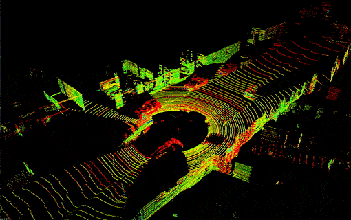
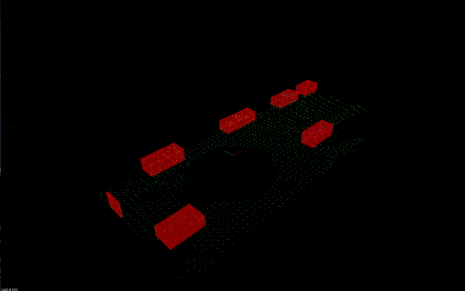
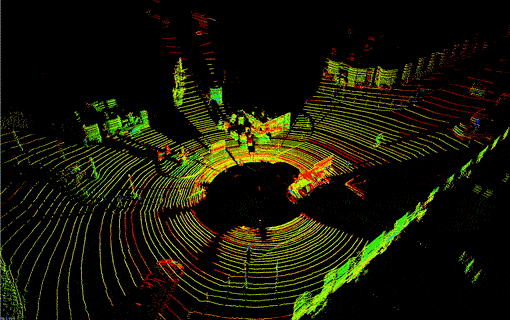
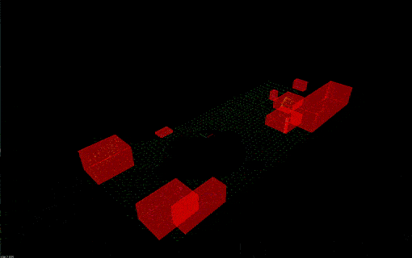

# Lidar Obstacle Detection 
## Sensor Fusion Engineer Nanodegree

This project contains code that demonstrates techniques of working 
with the real point cloud data collected with the Lidar sensor. 
The code extensively utilizes the 
[Point Cloud Library](http://pointclouds.org/) (PCL).
- The RANSAC algorithm is responsible for the separation between 
the road plane and obstacles. One can either choose between 
the PCL implementation of this algorithm or use the implementation 
provided in the [src/Ransac.hpp](src/Ransac.hpp) file.
- The obstacle identification is made using the Euclidean clustering 
algorithm, which internally uses a k-d tree to speed up the search of 
points in the point cloud. One can either choose between 
the PCL implementation of this algorithm or use the implementation 
provided in the 
[src/EuclideanClusterExtraction.hpp](src/EuclideanClusterExtraction.hpp) 
file.
- Internally, Euclidean clustering algorithm uses the k-d tree to speed-up the
search of points lying in the close proximity with the provided target point. 
The implementation of the Euclidean clustering algorithm
provided in the 
[src/EuclideanClusterExtraction.hpp](src/EuclideanClusterExtraction.hpp) 
file utilizes the k-d tree implementation from the file 
[src/KDTree.hpp](src/KDTree.hpp).

### Dependencies
- cmake >= 3.14
- gcc/g++ >= 8.0
- PCL >= 1.2

### Build
```
$> mkdir build
$> cd build
$> cmake ..
$> make
$> cd ..
```

### Run
```
$> build/lidar_obstacle_detection
```
or
```
$> lidar_obstacle_detection data/pcd/data_<num> <use_pcl>
```
where `<num>` can be 1 or 2 and `<use_pcl>` can be true or false. 
By default, `<num>` is set to 1 and `<use_pcl>` is set to false, 
meaning that implementations of RANSAC, Euclidean clustering, 
and k-d tree algorithms presented in this repository will be used.

### Demo
#### First set of point clouds



#### Second set of point clouds



### Results Description
On the upper side in the [Demo](#demo) section, the initial (unprocessed)
 point clouds are presented. On the lower side, there are processed point
  clouds, with identified and clustered points belonging to obstacles 
  (cars, road signs, bicyclists). Bounding boxes illustrate this separation.
